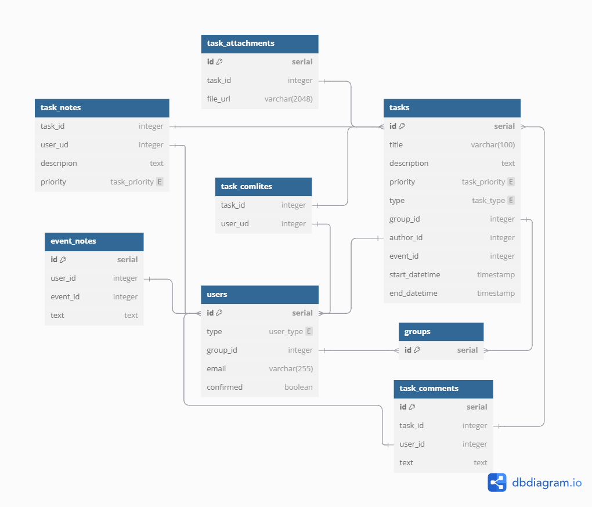

# MSU Hackathon 2025

- [MSU Hackathon 2025](#msu-hackathon-2025)
  - [Схема БД](#схема-бд)
  - [Запуск проекта](#запуск-проекта)
  - [Макет проекта](#макет-проекта)
  - [1. Клонировать проект](#1-клонировать-проект)
  - [2. Сгенерировать ключи JWT токена](#2-сгенерировать-ключи-jwt-токена)
  - [Запуск в Docker](#запуск-в-docker)
    - [3. Установить Docker Desktop](#3-установить-docker-desktop)
    - [4. Создать .env](#4-создать-env)
    - [5. Запуск](#5-запуск)
  - [Запуск вне Docker](#запуск-вне-docker)
    - [3. Установить uv](#3-установить-uv)
    - [4. Установить зависимости](#4-установить-зависимости)
    - [5. Создать .env.dev](#5-создать-envdev)
    - [6. Запуск](#6-запуск)

## Схема БД

<https://dbdiagram.io/d/68036ac91ca52373f58feb11>



## Макет проекта

<https://www.figma.com/board/KRSuWfTLQxtANdJqRfNE7u>


## Запуск проекта

## 1. Клонировать проект

```bach
git clone ...
```

## 2. Сгенерировать ключи JWT токена

```bash
mkdir ./keys

openssl genrsa -out ./keys/jwt-private.pem 2048
openssl rsa -in ./keys/jwt-private.pem -outform PEM -pubout -out ./keys/jwt-public.pem
```

## Запуск в Docker

### 3. Установить Docker Desktop

<https://www.docker.com/products/docker-desktop/>

### 4. Создать .env

```bash
cp .env.template .env
```

Заполните файл своими данными.

### 5. Запуск

```bash
docker compose up -d --build
```

## Запуск вне Docker

### 3. Установить uv

- Для Windows

  ```shell
  powershell -ExecutionPolicy ByPass -c "irm https://astral.sh/uv/install.ps1 | iex"
  ```

- Для Linux и Mac OS

  ```bash
  curl -LsSf https://astral.sh/uv/install.sh | sh
  ```

### 4. Установить зависимости

```bash
uv sync
```

### 5. Создать .env.dev

```bash
cp .env.template .env.dev
```

Заполните файл своими данными.

```bash
# Обязательно установить переменные окружения
BACKEND__DB__HOST=localhost

BACKEND__JWT__PRIVATE_KEY_PATH=
BACKEND__JWT__PUBLIC_KEY_PATH=
```

### 6. Запуск

- При неактивированном виртуальном окружении

  ```bash
  # dev
  uv run fastapi dev main.py

  # prod
  uv run fastapi run main.py
  ```

- При активированном виртуальном окружении

  ```bash
  # dev
  fastapi dev main.py

  # prod
  fastapi run main.py
  ```
